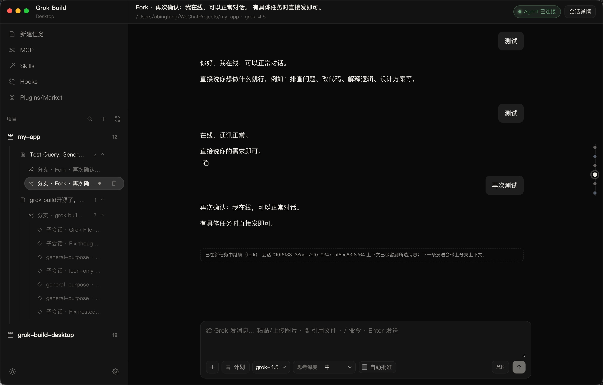
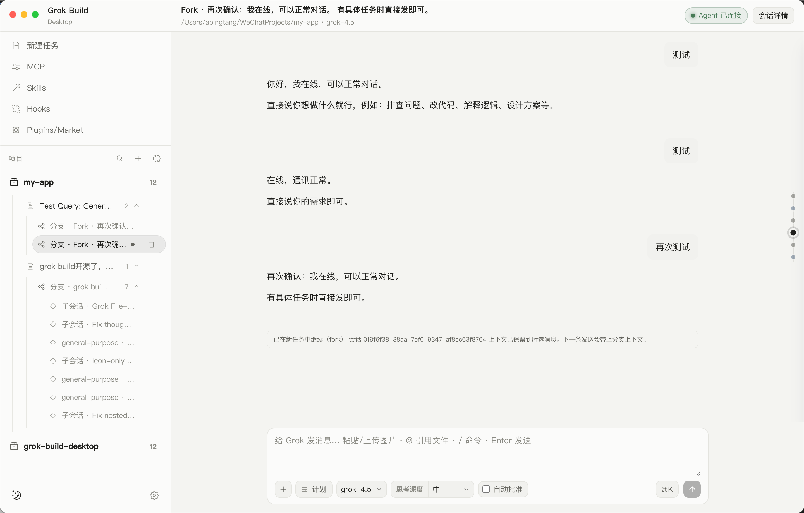

<div align="center">

# grok-build-client

### Unofficial macOS and Windows desktop client for the official [Grok Build CLI](https://x.ai/cli)

Gives the `grok` CLI a real window: project switcher, session history, streaming ACP chat, slash commands, and a capability inspector — without inventing third-party workflows.

[](#requirements)
[](#architecture)
[](#license--disclaimer)
[](#features)

**English** · [中文](#中文)

</div>

---

## Screenshots / 项目截图





---

## English

### Overview

**grok-build-client** wraps the official **Grok Build CLI** in an Electron + React shell. It is **not** affiliated with xAI / Grok.

- Talks to the real local `grok` binary (you install and log in yourself)
- **Does not** host model APIs
- Aligns with official CLI flags and ACP session behaviour — no custom “modes” layered on top

**Primary runtime:** `grok agent stdio` (ACP long-lived sessions)  
**Fallback:** `grok -p … --output-format streaming-json`

Model list comes from your installed CLI (`grok models`), not a hardcoded cloud picker.

### Features

- **ACP streaming chat** — long sessions over Agent Client Protocol; tools, reasoning, plan entries, and file edits show in a Codex-style process timeline
- **Headless fallback** — if ACP fails, runs continue via streaming JSON
- **Projects & sessions** — open / pin / remove projects; session list from `~/.grok/sessions` (`updates.jsonl`); search, resume, delete; nested fork / subagent sessions
- **Official CLI flags in the UI** — model, `--effort`, `--reasoning-effort`, `--always-approve`, `--permission-mode`, `--best-of-n`, web search, subagents, experimental memory, `--check`, `--cwd`, resume / continue
- **Slash commands** — type `/` for a TUI-aligned command catalog (session, model, memory, extensions, …)
- **Plan mode** — official ACP `session/set_mode plan`
- **Capability inspector** (`⌘I` / `Ctrl+I`) — context stats, plan, rewind points, MCP, skills, hooks, worktree, subagents (`grok inspect` + local scans)
- **Permission gate** — allow once / always / reject tool calls
- **Composer extras** — image & file attachments, `@` file mentions, in-memory prompt queue while a turn is running, fork from a message
- **Command palette** (`⌘K` / `Ctrl+K`) — quick actions for new chat, project, plan, compact, theme, …
- **Settings** (`⌘,` / `Ctrl+,`) — Claude Desktop–style modal for model / effort / permissions / theme / **UI language (中文 · English)**
- **Light & dark** themes

### Requirements

1. **macOS or Windows**
2. **Node.js 20+** and **npm**
3. **Grok Build CLI** installed and logged in:

   ```bash
   # Install: https://x.ai/cli
   grok login
   grok --version
   ```

4. Resolvable `grok` binary (first match wins):

   | Source | Path |
   |--------|------|
   | Env | `$GROK_BIN` |
   | Home install | `~/.grok/bin/grok` (macOS), `%USERPROFILE%\.grok\bin\grok.exe` (Windows) |
   | User local (macOS) | `~/.local/bin/grok` |
   | Homebrew / system (macOS) | `/opt/homebrew/bin/grok`, `/usr/local/bin/grok` |
   | PATH | `grok` (macOS), `grok.exe` (Windows) |

### Quick start

```bash
git clone https://github.com/abingtang/grok-build-client.git
cd grok-build-client
npm install
npm run electron:dev
```

`electron:dev` works in macOS Terminal, PowerShell, and Command Prompt. It will:

1. Start Vite on `http://127.0.0.1:5175` (or `VITE_PORT`)
2. Compile the Electron main process
3. Open Electron after the development server is ready

**Package → `release/`:**

```bash
# macOS DMG installer
npm run pack:mac

# Windows x64 NSIS installer (run on Windows)
npm run pack:win
```

**Typecheck only:**

```bash
npm run typecheck
```

### Scripts

| Command | Description |
|---------|-------------|
| `npm run electron:dev` | Cross-platform Vite + Electron development mode |
| `npm run electron:dev:raw` | Alias of `electron:dev` |
| `npm run dev` | Vite UI only (no Electron) |
| `npm run build` | Build renderer + main process |
| `npm run typecheck` | Full TypeScript check |
| `npm start` | Run Electron against an existing build |
| `npm run pack:mac` | Production build + macOS DMG installer |
| `npm run pack:win` | Production build + Windows x64 NSIS installer |
| `npm run test:windows` | Verify Windows Grok executable resolution |

### Environment variables

| Variable | Description |
|----------|-------------|
| `GROK_BIN` | Absolute path to the `grok` executable |
| `GROK_HOME` | Override default `~/.grok` |
| `VITE_PORT` | Dev server port (default `5175`) |
| `ELECTRON_OPEN_DEVTOOLS=1` | Open DevTools in dev mode |

### Architecture

```text
┌─────────────────────────────────────────────┐
│  React 19 UI (Vite)                         │
│  chat · project tree · settings · slash     │
│  inspector · command palette · i18n         │
└──────────────────┬──────────────────────────┘
                   │ preload (contextBridge)
┌──────────────────▼──────────────────────────┐
│  Electron main process                      │
│  IPC · AcpClient · HeadlessRunner · services│
└──────────────────┬──────────────────────────┘
                   │ spawn + stdio / CLI
┌──────────────────▼──────────────────────────┐
│  Local grok CLI                             │
│  agent stdio (ACP) · streaming-json · inspect│
└─────────────────────────────────────────────┘
```

**Design rules**

- Flags and capabilities stay close to the official CLI  
- Sessions live under `~/.grok` and stay compatible with the terminal TUI  
- Renderer never spawns `grok` directly — only via main + preload APIs  

### Project layout

```text
grok-build-client/
├── electron/           # Main process (ACP, IPC, CLI services)
├── src/                # Renderer (React UI + i18n)
├── scripts/            # Cross-platform development launcher
├── package.json
└── README.md
```

| Data path | Purpose |
|-----------|---------|
| `~/.grok/` | Official CLI home (sessions, config, binary) |
| `~/.grok-build-desktop/` | App data (e.g. `projects.json`) |

### Keyboard shortcuts

| Shortcut | Action |
|----------|--------|
| `⌘K` / `Ctrl+K` | Command palette |
| `⌘,` / `Ctrl+,` | Settings |
| `⌘I` / `Ctrl+I` | Capability inspector |
| `Enter` | Send |
| `Shift+Enter` | Newline |
| `/` | Slash command menu |
| `Esc` | Stop turn / reject permission (context-dependent) |

### Troubleshooting

| Symptom | What to try |
|---------|-------------|
| Cannot chat / grok not found | Run `which grok` (macOS) or `where.exe grok` (Windows), then `grok login`; otherwise set `GROK_BIN` |
| GUI PATH too short | App prepends `~/.grok/bin`, `/opt/homebrew/bin`, …; still broken → `GROK_BIN` |
| Port in use | Change `VITE_PORT`, or free `5175` and re-run `electron:dev` |
| Windows packaging fails on macOS | Run `npm run pack:win` on Windows; this project does not configure cross-signing |
| Empty session list | Check `~/.grok/sessions` and that the project cwd matches |
| Too many permission dialogs | Enable Always approve, or change permission mode in Settings |

### License & disclaimer

- License: **MIT** (see `package.json`; add a root `LICENSE` file when publishing if you prefer an explicit copy)
- Unofficial project; provided **as is** for local / learning use
- Using Grok CLI and xAI services remains subject to their terms of service

---

## 中文

### 简介

**grok-build-client** 是非官方 **macOS / Windows** 桌面客户端，用 **Electron + React** 包装官方 [Grok Build CLI](https://x.ai/cli)。与 xAI / Grok **无关联**。

- 依赖本机已安装并 `grok login` 的 `grok` 二进制  
- **不**托管模型 API  
- 能力对齐官方 CLI 与 ACP，**不**另造第三方工作流 / 模式  

**主路径：** `grok agent stdio`（ACP 长会话）  
**兜底：** `grok -p … --output-format streaming-json`

模型列表来自本机 `grok models`，不会静默换成你没选的模型。

### 功能

- **ACP 流式对话** — 长会话；工具、推理、计划、文件编辑按时间序呈现在过程时间线中  
- **Headless 兜底** — ACP 失败时回退 streaming JSON  
- **项目与会话** — 打开 / 置顶 / 移除项目；会话读自 `~/.grok/sessions`；搜索、恢复、删除；支持 fork / 子会话  
- **官方参数上屏** — 模型、`--effort`、`--reasoning-effort`、始终批准、权限模式、Best-of-N、Web 搜索、子代理、实验性记忆、自验证、工作目录、resume 等  
- **斜杠命令** — 输入 `/` 打开与 TUI 同款命令目录  
- **Plan 模式** — 官方 ACP `session/set_mode plan`  
- **能力检查器**（`⌘I` / `Ctrl+I`）— 上下文、Plan、Rewind、MCP、Skills、Hooks、Worktree、子代理
- **权限门** — 允许一次 / 始终允许 / 拒绝  
- **输入增强** — 图片与文件附件、`@` 引用文件、回合进行中的消息队列、从某条消息分叉  
- **命令面板**（`⌘K` / `Ctrl+K`）— 新建对话、打开项目、Plan、compact、主题等
- **设置**（`⌘,` / `Ctrl+,`）— 模型 / 力度 / 权限 / 主题 / **界面语言（中文 · English）**
- **浅色 / 深色** 主题  

### 环境要求

1. **macOS 或 Windows**
2. **Node.js 20+** 与 **npm**  
3. 已安装并登录的 **Grok Build CLI**：

   ```bash
   # 安装见 https://x.ai/cli
   grok login
   grok --version
   ```

4. 能解析到 `grok`（按优先级）：

   | 来源 | 路径 |
   |------|------|
   | 环境变量 | `$GROK_BIN` |
   | 家目录安装 | macOS：`~/.grok/bin/grok`；Windows：`%USERPROFILE%\.grok\bin\grok.exe` |
   | 用户本地（macOS） | `~/.local/bin/grok` |
   | Homebrew / 系统（macOS） | `/opt/homebrew/bin/grok`、`/usr/local/bin/grok` |
   | PATH | macOS：`grok`；Windows：`grok.exe` |

### 快速开始

```bash
git clone https://github.com/abingtang/grok-build-client.git
cd grok-build-client
npm install
npm run electron:dev
```

`electron:dev` 可在 macOS 终端、PowerShell 和命令提示符中运行，它会：

1. 启动 Vite（默认 `http://127.0.0.1:5175`，可用 `VITE_PORT` 修改）
2. 编译 Electron 主进程
3. 开发服务器就绪后打开 Electron

**打包（产物在 `release/`）：**

```bash
# macOS DMG 安装包
npm run pack:mac

# Windows x64 NSIS 安装程序（请在 Windows 上运行）
npm run pack:win
```

**仅类型检查：**

```bash
npm run typecheck
```

### 常用脚本

| 命令 | 说明 |
|------|------|
| `npm run electron:dev` | 跨平台 Vite + Electron 开发模式 |
| `npm run electron:dev:raw` | `electron:dev` 的别名 |
| `npm run dev` | 仅 Vite 前端 |
| `npm run build` | 构建前端 + 主进程 |
| `npm run typecheck` | 全量 TypeScript 检查 |
| `npm start` | 用已有构建启动 Electron |
| `npm run pack:mac` | 生产构建 + macOS DMG 安装包 |
| `npm run pack:win` | 生产构建 + Windows x64 NSIS 安装程序 |
| `npm run test:windows` | 验证 Windows Grok 可执行文件解析 |

### 环境变量

| 变量 | 说明 |
|------|------|
| `GROK_BIN` | `grok` 可执行文件绝对路径 |
| `GROK_HOME` | 覆盖默认 `~/.grok` |
| `VITE_PORT` | 开发服务器端口（默认 `5175`） |
| `ELECTRON_OPEN_DEVTOOLS=1` | 开发模式打开 DevTools |

### 架构

与上方 English 示意图相同：

**React UI** → **preload** → **Electron 主进程** → **本机 `grok`（ACP / streaming-json / inspect）**

原则：

- 参数与能力贴近官方 CLI  
- 会话数据复用 `~/.grok`，与终端 TUI 互通  
- 渲染进程不直接 `spawn` CLI  

### 项目结构

```text
grok-build-client/
├── electron/           # 主进程（ACP、IPC、CLI 服务）
├── src/                # 渲染进程（React UI + 国际化）
├── scripts/            # 跨平台开发启动器
├── package.json
└── README.md
```

| 数据路径 | 用途 |
|----------|------|
| `~/.grok/` | 官方 CLI 家目录（会话、配置、二进制） |
| `~/.grok-build-desktop/` | 本应用数据（如 `projects.json`） |

### 快捷键

| 快捷键 | 作用 |
|--------|------|
| `⌘K` / `Ctrl+K` | 命令面板 |
| `⌘,` / `Ctrl+,` | 设置 |
| `⌘I` / `Ctrl+I` | 能力检查器 |
| `Enter` | 发送 |
| `Shift+Enter` | 换行 |
| `/` | 斜杠命令菜单 |
| `Esc` | 停止本轮 / 拒绝权限（视上下文） |

### 故障排查

| 现象 | 建议 |
|------|------|
| 无法对话 / 找不到 grok | macOS 运行 `which grok`，Windows 运行 `where.exe grok`；再执行 `grok login`，或设置 `GROK_BIN` |
| GUI 下 PATH 过短 | 应用会补充常见路径；仍失败时用 `GROK_BIN` |
| 端口占用 | 改 `VITE_PORT`，或释放 `5175` 后重跑 |
| 在 macOS 打包 Windows 失败 | 请在 Windows 上运行 `npm run pack:win`；项目未配置跨平台签名 |
| 会话列表为空 | 检查 `~/.grok/sessions` 与项目 cwd |
| 权限弹窗过多 | 设置中开启始终批准，或调整权限模式 |

### 许可与免责

- 许可证：**MIT**（见 `package.json`；对外发布时可补一份根目录 `LICENSE`）  
- 非官方项目，按「原样」提供，仅供本机学习与使用  
- 使用 Grok CLI 与 xAI 服务时，请遵守其服务条款  

---

<div align="center">
<sub>Built for people who live in the <code>grok</code> CLI — with a window on top.</sub>
</div>
